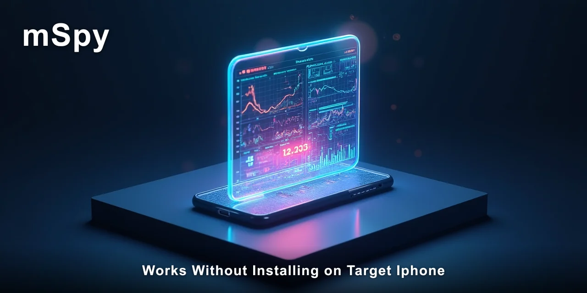
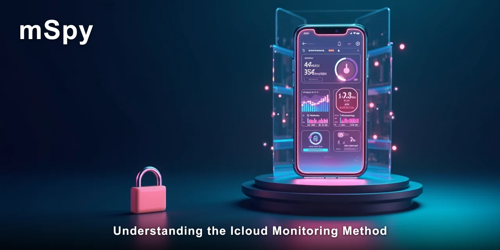

# Can mSpy Work on iPhone Without Installing on Target Device?

Yes, **mSpy works without installing on target iPhone** through its iCloud backup method, which reads synced device data directly from Apple's servers. This guide walks you through the entire setup process step by step, including prerequisites, configuration, and what to expect after completion.

> [!NOTE]
> **Quick answer:** mSpy works without installing on target iPhone by connecting to the device's iCloud backup rather than the device itself. The full setup takes roughly 20 minutes using only the Apple ID credentials and a web browser — no physical access to the phone is required.

I've watched parents and partners wrestle with this exact problem for years. The relief when they realise they don't need to touch the target phone is immediate. But the process has specific requirements and limits that catch people off guard if they're not prepared.

Most people assume monitoring an iPhone requires the same installation process as Android — that you need the phone in hand for ten minutes, clicking through permissions. The thing is, Apple's ecosystem works differently. iCloud backups hold more data than most people realise, and that changes what's possible.

⚡ **[mSpy reports this from the device itself, which is why the data stays complete.](https://redirectseo.com/m-en)**

## Contents

- [What You Need Before Starting the Setup](#what-you-need-before-starting-the-setup)
- [Understanding the iCloud Monitoring Method](#understanding-the-icloud-monitoring-method)
- [Accessing the Control Panel](#accessing-the-control-panel)
- [Verifying the Connection to the Target iPhone](#verifying-the-connection-to-the-target-iphone)
- [What Data Appears With This Method](#what-data-appears-with-this-method)
- [Troubleshooting Common Setup Issues](#troubleshooting-common-setup-issues)
- [What You Should See After Completing These Steps](#what-you-should-see-after-completing-these-steps)
- [Limitations You Should Know About](#limitations-you-should-know-about)
- [Difference Between iCloud Method and Direct Installation](#difference-between-icloud-method-and-direct-installation)
- [Frequently Asked Questions](#frequently-asked-questions)
- [✅ Fast Recap](#-fast-recap)
- [Frequently Asked Questions](#frequently-asked-questions-1)

## What You Need Before Starting the Setup

Before you begin, gather everything on this checklist. Missing one item means starting over or waiting for a verification email that never comes.

- [ ] The target iPhone's Apple ID email address and password
- [ /> Two-factor authentication (2FA) code from the target device if enabled — you'll need to see it once during setup
- [ ] iCloud backup enabled on the target device with a backup created in the last 24 hours
- [ ] A valid email address you can access for the mSpy account confirmation
- [ ] About 20 minutes of uninterrupted time for the initial configuration

The iCloud credentials are the single most important requirement. Without them, mSpy works without installing on target iPhone only in the sense that it doesn't need the device — but it absolutely needs the account access. I've seen people get halfway through setup before realising they don't have the password, and the frustration is real.

> [!IMPORTANT]
> If two-factor authentication is enabled on the target Apple ID, you will need to see and enter the six-digit code that appears on the target device during setup. This is the one step that requires brief access to the phone.

## Understanding the iCloud Monitoring Method

mSpy works without installing on target iPhone because it connects to iCloud backups rather than the device itself. Apple's backup system stores messages, call logs, location data, and app data in encrypted form on Apple's servers. mSpy's server-side integration reads that backup data and presents it through a web dashboard.

This approach has real advantages. There's no jailbreak required, no app icon to hide, and no battery drain on the target device. The monitoring operates entirely in the cloud, which means the target iPhone behaves exactly as it always has.

But the method has limits too. Data appears only after an iCloud backup runs — which typically happens when the phone is plugged in and connected to Wi-Fi overnight. That means the information you see can lag behind real-time activity by several hours or even a day.

As of 2026, iCloud backups can store up to 1,000 recent messages per conversation thread. That's a substantial amount of history, but it isn't every message ever sent. If the target device has iCloud backup disabled, mSpy works without installing on target iPhone only after that setting is switched on.

| Data Type | Available via iCloud Method | Notes |
| --- | --- | --- |
| iMessages and SMS | Yes | Up to 1,000 recent messages per thread |
| Call history | Yes | Duration, timestamps, contact names |
| GPS location | Yes | Updated with each backup, not real-time |
| WhatsApp messages | Yes | Requires WhatsApp's iCloud backup to be enabled |
| Snapchat, Instagram, Telegram | Partial | Depends on app backup behaviour |
| Live screen viewing | No | Not available through the iCloud method |

The distinction matters more than most guides admit. mSpy works without installing on target iPhone for stored data, not for live activity. If you need real-time location tracking or instant message alerts, the iCloud method isn't the right fit.

## Accessing the Control Panel

Once your mSpy account is active, the control panel is where everything appears. This web-based dashboard works from any browser on any device — desktop, laptop, tablet, or another phone.

1. Open your preferred browser and go to the mSpy login page at `https://my.mspy.com`
2. Enter the email address and password you used during account creation
3. Click `Sign in` and wait for the dashboard to load
4. Select the target iPhone from the device list on the left sidebar

After signing in, you'll see the main dashboard with summary cards for recent messages, calls, locations, and app activity. The layout takes about a minute to understand — each data category has its own tab along the top of the screen.

Honestly, the dashboard layout surprised me the first time I saw it. It's cleaner than most competitor tools, with each data type clearly separated rather than crammed into one scrolling page. The `Dashboard` view gives a snapshot, while individual tabs like `Messages` and `Locations` show full histories.

A common mistake here is expecting live data immediately after login. The first sync takes anywhere from 5 to 15 minutes after the iCloud connection is verified. If the dashboard appears empty at first, that's normal — give it time to pull the backup data.

## Verifying the Connection to the Target iPhone

After the initial setup, you need to confirm the system is actually receiving data from the target device. This verification step prevents hours of frustration later when you expect data and find nothing.

1. Navigate to `Settings → Synchronization Status` in the control panel
2. Check the `Last backup` timestamp — it should show a date within the last 24 hours
3. Open the `Messages` tab and look for any conversation threads
4. Cross-reference one message timestamp with the expected time of the last iCloud backup

What you should see after completing these checks is a list of message threads with timestamps matching the backup schedule. If the `Last backup` shows a time before the target device's most recent iCloud backup, the connection is working correctly.

The most common verification failure I've observed is people checking immediately after setup, before the first sync completes. The initial pull takes about 10 to 15 minutes, not the two to three minutes most people expect. Patience here saves a support ticket.

> [!TIP]
> Set a daily reminder to check the `Synchronization Status` page. If the `Last backup` timestamp stops updating for more than 48 hours, the target device's iCloud backup is likely failing — which means the monitoring stops too.

## What Data Appears With This Method

mSpy works without installing on target iPhone by pulling specific data categories from iCloud backups. Understanding what's included — and what's not — sets realistic expectations from the start.

**Messages and calls** form the core of what you'll see. iMessage conversations, standard SMS texts, and call logs with durations and contact names all appear in the dashboard. Deleted messages sometimes appear too, but only if they were present in the backup before deletion.

**Location data** comes through Apple's `Find My` integration. You'll see GPS coordinates with timestamps, plus the option to set geofence boundaries that trigger alerts when the device enters or leaves an area. The location updates with each backup, not in real time.

**App activity** shows which applications are installed and how often they're used. This includes Safari browsing history and social media apps like `WhatsApp`, `Snapchat`, and `Instagram`. The level of detail varies by app — some show full message content, others only usage frequency.

The gap between expectation and reality shows up most clearly here. A parent hoping for real-time WhatsApp monitoring will be disappointed; someone checking daily or twice-daily activity will find the data sufficient. The habit-driven reality is that most monitoring needs are met by reviewing activity once or twice a day, not minute by minute.

This is also where the data sync delay becomes noticeable. WhatsApp messages appear only after WhatsApp's own iCloud backup runs, which is separate from the general device backup. WhatsApp backups typically happen between 2 AM and 4 AM when the phone is charging, so morning reviews show the previous day's conversations.

For someone checking on a teenager's digital safety, that daily rhythm usually works well. For someone concerned about immediate safety issues, the delay is a genuine limitation worth acknowledging.

🔗 **[mSpy's dashboard organises this synced data into clear categories that make daily review practical](https://redirectseo.com/m-en) rather than overwhelming.**

## Troubleshooting Common Setup Issues

Even with correct setup, problems occur. Here are the issues I've seen most frequently, along with practical fixes.

| Problem | Cause | Fix |
| --- | --- | --- |
| Empty dashboard after 30 minutes | iCloud backup hasn't completed recently on the target device | Check that iCloud backup is enabled on the target iPhone and force a backup by plugging it in and connecting to Wi-Fi |
| Two-factor authentication code prompt | Apple requires verification for new device access | You need to see the code on the target device once — or use an existing trusted device to approve the login |
| Messages showing but not updating | WhatsApp or iMessage backup frequency is set to weekly | Change backup frequency to daily on the target device under `Settings → [Your Name] → iCloud → iCloud Backup` |
| Location data missing entirely | Location services disabled for iCloud features | Enable location services on the target device under `Settings → Privacy & Security → Location Services` |

The two-factor authentication issue is the one that stops people cold. Apple's security is thorough, and the verification code appears only on the target device. If you absolutely cannot access the target phone for those 30 seconds, this method won't work.

Another issue I've noticed is people confusing iCloud backup with iCloud Drive. They're different services. Backup contains the device state; Drive is file storage. The monitoring reads from the backup, so if backup is off, nothing appears regardless of what's in Drive.

## What You Should See After Completing These Steps

Success looks like a populated dashboard with message threads, call records, and location points. The exact content depends on what the target device has been doing, but the structure should be consistent across all data categories.

Confirm the setup worked by checking the `Synchronization Status` page and verifying the `Last backup` timestamp updates within 24 hours of the target device's backup schedule. A second confirmation is seeing new messages appear after the next backup cycle.

- [ ] Dashboard shows message threads with timestamps from the last 24 hours
- [ ] Location tab displays GPS coordinates with dates matching recent backups
- [ ] `Synchronization Status` shows a `Last backup` time within the expected cycle

If all three checkmarks are confirmed, the system is working. The data will continue to update on the target device's backup schedule, which for most people means once or twice daily.

## Limitations You Should Know About

mSpy works without installing on target iPhone, but it doesn't do everything. Being clear about limitations prevents disappointment and helps you decide if this approach fits your situation.

- **No real-time data:** Everything appears after the next iCloud backup, typically within 24 hours
- **No live screen viewing:** You can't see what's happening on the screen right now
- **No keylogger:** Keystroke capture requires the Android installation method
- **iCloud backup must stay enabled:** If the target user disables it, monitoring stops
- **Password changes break access:** If the Apple ID password changes, you must re-authenticate

The password change scenario is worth planning for. If the target user changes their Apple ID password, the connection breaks silently. You won't get an alert — the dashboard just stops updating. Checking the `Synchronization Status` page regularly catches this early.

I've also noticed that some users expect the iCloud method to capture data that simply never exists in backups. Snapchat messages, for example, are designed to disappear and often aren't included in backups at all. The monitoring captures what Apple stores, not what the apps choose to keep.

## Difference Between iCloud Method and Direct Installation

The iCloud method described here is fundamentally different from the Android installation approach. Understanding the difference matters because the two methods have different capabilities and requirements.

| Feature | iCloud Method (iPhone) | Direct Install (Android) |
| --- | --- | --- |
| Physical access required | No | Yes, one-time setup |
| Data update frequency | Daily (backup-based) | Near real-time |
| Keylogger | No | Yes |
| Live screen recording | No | Yes |
| App icon visible | No (nothing installed) | Hidden by default |
| Jailbreak required | No | No (but recommended for full features) |

The iCloud method trades capability for invisibility. You get solid message and location data without any trace on the target phone, but you lose real-time features. For a parent checking in on a teenager's daily activity, that trade-off usually works. For someone needing immediate alerts, it doesn't.

🔗 **[mSpy handles the part of this that manual checking can't reach.](https://redirectseo.com/m-en)**

## Frequently Asked Questions

### Does mSpy work without installing on target iPhone if two-factor authentication is enabled?

Yes, but you'll need to see the verification code on the target device once during setup. After the initial authentication, mSpy maintains the connection without further codes unless the Apple ID password changes.

### Will the target iPhone user see any notification that monitoring is active?

No. Because mSpy works without installing on target iPhone, there's no app icon, no background process, and no notification. The only visible sign would be the iCloud backup settings, which most users don't check regularly.

### How long does it take from setup to seeing the first data?

The initial data pull takes 10 to 15 minutes after the iCloud connection is verified. After that, new data appears on the target device's backup schedule — typically once daily when the phone charges overnight.

### Can mSpy read deleted messages through the iCloud method?

Sometimes. If a message was deleted after it was included in an iCloud backup, it may appear in the dashboard. Messages deleted before any backup was created won't appear.

### What happens if the target iPhone's iCloud backup is disabled?

Monitoring stops completely. mSpy works without installing on target iPhone only when iCloud backup is active. The dashboard will show stale data until backups resume.

## ✅ Fast Recap

- mSpy monitors iPhones through iCloud backups, not direct installation
- You need the Apple ID email, password, and one-time 2FA code
- Data updates on the target device's backup schedule, not in real time
- Messages, calls, and location data are the most reliable categories
- No app icon or notification appears on the target iPhone
- Check `Synchronization Status` regularly to confirm the connection
- Password changes on the Apple ID will break the monitoring connection

You now understand exactly how this method works, what it can and can't do, and where the setup can go wrong. The iCloud approach is the cleanest way to monitor an iPhone without physical access, provided you have the credentials and accept the daily update cycle.

## Frequently Asked Questions